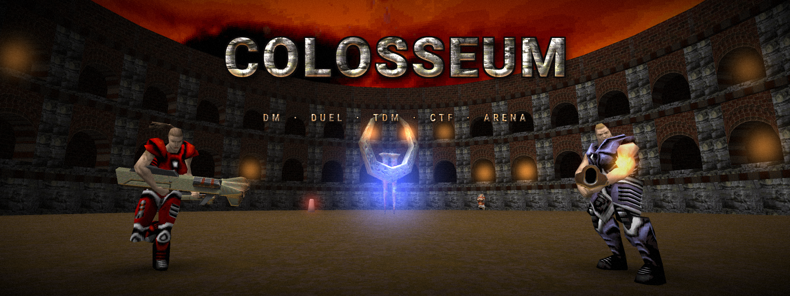

# Colosseum

One modern Quake II game library that unites baseq2, both mission packs, Threewave CTF, Rocket Arena 2 and OSP Tourney DM on a single Q2PRO-derived code base, with the Gladiator Bot's commands and botlib support added on top.

One library, one venue, many rulesets, with Mr. Elusive's Gladiator bots as the opponents.

* [What you get](#what-you-get)
* [Requirements](#requirements)
* [Installing](#installing)
* [Bots](#bots)
* [Playing](#playing)
* [Configuring](#configuring)
* [Securing your server](#securing-your-server)
* [Known limitations](#known-limitations)
* [Releases](#releases)
* [Documentation](#documentation)
* [Reporting a bug](#reporting-a-bug-and-asking-for-help)
* [Licence](#licence)
* [Credits](#credits)

Building Colosseum, and the checks that come with it, are in [`DEVELOPMENT.md`](DEVELOPMENT.md).

## What you get

One library provides seven rulesets. `g_ruleset` sets one at startup, and it stays fixed for the rest of the map:

| ruleset | what it is |
|---|---|
| `dm` | OSP Tourney DM's RegularDM - baseq2 deathmatch, with the tourney match system over it |
| `dmpro` | OSP QualifierDM (like usual DM but with ready up phase) |
| `tdm` | OSP TeamPlay |
| `duel` | OSP 1-vs-1 |
| `ctf` | Threewave Capture The Flag 1.52 |
| `arena` | Rocket Arena 2 v2.25 |
| `sp` | the three campaigns - baseq2, The Reckoning, Ground Zero - single and co-op |

The first four are OSP Tourney DM v2.75's four structures of play.

`xatrix` and `rogue` are **content layers**, orthogonal to all seven and valid with any of them: set either to 1 and that mission pack's monsters, weapons and items are available in whatever ruleset is running.

Six small Gladiator Bot features have been ported over from the Gladiator Bot game library as well: the game log, client lag simulation, two trigger entities from 1999, the rotating button, and the eye/chasecam observer. `sv extras` reports which of them are on.

Bots play in every ruleset but `sp` - all six multiplayer ones. They load, spawn, navigate, fight and chat, and each ruleset has its own way in: under `ctf` a bot joins the team that `botctfteam` selects, under `arena` it queues for the arena that the `arena` cvar picks, and under the four OSP rulesets they enter the match and ready up after `bots_warmuptime`. 32 of them on `q2dm1` cost about 2.5 ms out of each 100 ms server frame, which `sv botperf` reports.

## Requirements

**An engine.** Colosseum is a plain Quake II game library and doesn't patch the game engine. What it needs is an engine that speaks one of the two game APIs it can be built for:

| engine | the build to use |
|---|---|
| [Q2PRO](https://github.com/packetflinger/q2pro) with `USE_NEW_GAME_API` - **recommended** | the default (`GAME_API_VERSION_NEW`, 3302) |
| [R1Q2](https://github.com/tastyspleen/r1q2-archive), [Yamagi Quake II](https://github.com/yquake2/yquake2), [Quake II RTX](https://github.com/NVIDIA/Q2RTX), id's own 3.20, or a Q2PRO built without `USE_NEW_GAME_API` | `API=old` (`GAME_API_VERSION_OLD`, 3) - see [`DEVELOPMENT.md`](DEVELOPMENT.md#the-old-game-api) |

**Q2PRO is the recommended engine and the one the tests run against.** It is the only engine that offers the current game API, so it is also the only one whose HUD has room for 64 readouts instead of 32 - **stat slots**, as `sv slots` calls them. That spare room is what lets `ctf` show a second powerup timer.

**R1Q2 and Yamagi Quake II can run Colosseum as well**, on the `API=old` build. If you hand them the default build instead they will refuse to load it, naming the API version.

Engines disagree about what to call the file: Q2PRO wants `game<cpu>.so`, R1Q2 the same shape (`gamei386.so`, `gamex86_64.so`), Yamagi a flat `game.so`. Name it whatever yours looks for.

**Game data.** Colosseum ships code and configuration, but none of the game assets, and it loads against the **original 1998 maps and paks**. Every one of these is somebody else's data, and you supply it:

* **Quake II** - **mandatory.** The retail game, from the CD, [GOG](https://www.gog.com/en/game/quake_ii_quad_damage) or [Steam](https://store.steampowered.com/app/2320/QUAKE_II/). Every ruleset is played on its data, and it is the one thing nothing works without.
* **The Reckoning** - *optional*, needed for `xatrix 1` and for that mission pack's campaign. Retail: GOG's [Quake II: Quad Damage](https://www.gog.com/en/game/quake_ii_quad_damage) is the base game and both mission packs in one purchase.
* **Ground Zero** - *optional*, needed for `rogue 1` and for that mission pack's campaign. Retail, in the same bundle as The Reckoning.
* **Threewave Capture The Flag** - *optional*, needed for the `ctf` maps, player skins and tech icons. Free since 1999: [`q2ctf150.zip`](https://www.gamers.org/pub/mirrors/ftp.idsoftware.com/quake2/ctf/q2ctf150.zip) (9 MB) at id software's mirror.
* **Rocket Arena 2** - *optional*, needed for the `ra2map*` maps the shipped `arena.cfg` describes. Free since 1999: [`ra2250cl.exe`](https://www.gamers.org/pub/mirrors/ftp.planetquake.com/servers/arena/ra2250cl.exe) (41 MB), the v2.50 client, which carries all of `ra2map1`-`ra2map28`.
* **The Gladiator Bot assets** - *optional*, needed only if you want bots. Free since 1999: [`gladq2096_win32-x86.exe`](https://mrelusive.com/oldprojects/gladiator/ftp/gladq2096_win32-x86.exe) (1.1 MB), whose `pak7.pak` is the part that matters; the [Gladiator download page](https://mrelusive.com/oldprojects/gladiator/download.shtml.htm) has the two Linux archives of the same release. The [Bots paragraph](#bots) covers what else they want.

So only the two mission packs cost money, and a server that runs `dm`, `dmpro`, `tdm` or `duel` on the stock maps needs nothing beyond retail Quake II - plus the bot assets, if you want bots.

A ruleset started without the data it wants still runs - it just loads whatever map you give it. `arena` on `q2dm1` is a working arena server; it is simply not the one `arena.cfg` describes.

## Installing

**Everything goes in one `colosseum/` folder**: the game library, the config set from this repository, the paks the rulesets play on, and everything the bots need. **A release package is that folder, already assembled** - unpack it and copy its `colosseum/` into place; the paks are the only thing you add. Which folder it goes in depends only on how your Q2PRO was installed, and there are two cases:

| your Q2PRO | put `colosseum/` here |
|---|---|
| unpacked into a directory of its own - **always the case on Windows** | beside the engine: `Quake2\colosseum\`, `quake2/colosseum/` |
| installed by a Linux distribution package | in your home directory: `~/.q2pro/colosseum/` |

If you are not sure which one you have type `path` at the engine's console - it prints the directories it is actually searching. A package-installed engine shows `/usr/share/...` and `~/.q2pro/...` entries; an unpacked one shows only paths under its own folder. On R1Q2 or Yamagi the home directory is that engine's own rather than `~/.q2pro/`, and `path` will name it.

**The library is the one file that is fussy about its name.** It is named for the platform it was built for - `gamex86_64.dll` or `gamex86.dll` on Windows, `gamex86_64.so`, `gamei386.so` or `gamearm64.so` on Linux, `gamex86_64.dylib` or `gamearm64.dylib` on macOS. Take it from a release or build it yourself ([`DEVELOPMENT.md`](DEVELOPMENT.md#building)). A release package carries **two** builds under that one name, both inside its `colosseum/`: the one in the folder itself is for the new game API, and `colosseum/oldapi/` holds the old one. Find your engine in the table in [Requirements](#requirements); if it wants the classic ABI, copy that second file over the first and delete the `oldapi/` directory, and either way rename it to whatever your engine looks for - Yamagi, for one, wants a flat `game.so`. The engine only ever looks for a library in the gamedir itself, so the spare build sits in that subdirectory doing nothing until you use it.

**Nothing in the config set is required.** Every value in it is a default the code already carries, written down so you can see and change it; `colosseum/README.md` says what each file is.

### The paks

The engine searches exactly two places: the gamedir it is running - `colosseum/` - and `baseq2`. It never looks anywhere else, so a `ctf/` or `xatrix/` folder sitting beside them is invisible to the mod, and **every mod's paks have to be copied into `colosseum/`**. Retail Quake II's own paks are the exception: they stay where they are, in `baseq2/`.

**Every one of these mods ships its data as `pak0.pak`**, so they have to be renumbered on the way in or each would overwrite the last. Keep Quake II's own `pak<n>.pak` naming and **number them from 0**: `colosseum/` counts on its own, with nothing carried over from `baseq2/`. The two directories never collide: the engine keeps them apart and searches the gamedir ahead of `baseq2` whatever the numbers are, so a `colosseum/pak0.pak` and a `baseq2/pak0.pak` sit side by side without either one touching the other.

What a number does decide is the order **within** `colosseum/`: a **higher number is loaded later and wins** where two archives carry the same file. That is why the order in the table below is the one to keep: the mission packs first, then the mods the rulesets come from.

| you want | copy these files | into `colosseum/` as | which gives you |
|---|---|---|---|
| to play at all | nothing to copy - retail `pak0.pak`-`pak3.pak` stay in `baseq2/` | - | the retail game, which every ruleset is played on |
| `xatrix 1` | `pak0.pak` from **The Reckoning** | `pak0.pak` | the pack's monsters, weapons, items and its campaign maps |
| `rogue 1` | `pak0.pak` from **Ground Zero** | `pak1.pak` | the same for Ground Zero |
| `ctf` | `pak0.pak` and `pak1.pak` from [`q2ctf150.zip`](https://www.gamers.org/pub/mirrors/ftp.idsoftware.com/quake2/ctf/q2ctf150.zip), **Threewave Capture The Flag** at id's own mirror | `pak2.pak`, `pak3.pak` | `q2ctf1`-`q2ctf8`, the CTF player skins and the tech icons |
| `arena` | `arena/pak0.pak`, `arena/pak1.pak` and `arena/pak2.pak` from the **Rocket Arena 2** v2.50 client [`ra2250cl.exe`](https://www.gamers.org/pub/mirrors/ftp.planetquake.com/servers/arena/ra2250cl.exe) | `pak4.pak`, `pak5.pak`, `pak6.pak` | `ra2map1`-`ra2map28`, which is what the shipped `arena.cfg` addresses |
| bots | **`pak7.pak`** from the original Gladiator Bot v0.96 release - [`gladq2096_win32-x86.exe`](https://mrelusive.com/oldprojects/gladiator/ftp/gladq2096_win32-x86.exe), an InstallShield installer (7-Zip can open it); the two Linux tarballs on the [download page](https://mrelusive.com/oldprojects/gladiator/download.shtml.htm) hold `pak7.pak` as a plain archive entry | `pak7.pak` - **unchanged** | the botlib's weapon, item, sound and chat configs |
| `sp` | nothing beyond the above | - | baseq2's campaign from the retail paks, and a mission pack's campaign once its row is done |

If you install only some of the mod rows, the numbers close up: take the ones you want, keep this order, and number them from 0 with no gaps.

**The bot pak is the one row that is never renamed.** It stays at 7 no matter how many of the rows above it you installed, so `colosseum/pak7.pak` is a straight copy of the file the Gladiator release ships, under the name it already has.

The RA2 download is a Windows self-extractor, and also an ordinary zip archive that `unzip` opens on any platform; its three paks are under `arena/` inside it. Take a `*cl.exe` **client** package and not a `*sv.zip`, which holds the mod's own library and no maps at all. The v2.20 client on that mirror is two paks rather than three and stops at `ra2map17`; the `*up.exe` files are upgrades for an existing 2.20 install and carry `pak2.pak` only.

Two extra details: some Threewave distributions ship a loose `q2ctf4a.bsp` beside the paks, which goes in `colosseum/maps/`; and **do not** copy any pack's `game.so` or `gamex86.dll` - that is the pack's own game library, and Colosseum is what replaces it. The loose `maps/`, `music/` and `video/` directories beside those paks are not needed by a server either.

Bots need three more things than that one pak - the botlib file (`gladiator.so`/`gladiator.dll`) itself, the bot list, and one AAS file per map. **A release package brings the botlib and eight of the AAS files**, so the bot list is the only one of the three left to install.

## Bots

The bot AI lives in its own shared library - the **botlib**, `gladiator.so` on Linux and macOS, `gladiator.dll` on Windows. It is not part of the game library: it is a separate build of a separate repository, and **every release package carries the build for its own platform**, in the `colosseum/` folder of the package. That is the same `colosseum/` folder everything else goes in, and three files belong beside it:

```
colosseum/gladiator.so        the botlib, built for this platform -
                              in the release package already
colosseum/pak7.pak            its weapon, item, sound and chat configs,
                              copied straight across under its own name
colosseum/botcfg/bots.cfg     the bot list
colosseum/maps/q2dm1.aas      one AAS file PER MAP - q2dm1..q2dm8
                              are in the release package already
```

All three come from the `gladiator-bot-restored` submodule at `vendor/gladiator-bot-restored/`: the botlib is built there (`make botlib`, see [`DEVELOPMENT.md`](DEVELOPMENT.md#building-the-botlib)), and `pak7.pak` and `bots.cfg` are in its `assets/`. A package spares you the first of those - the packaging job builds the botlib with the same compiler it built the game library with, so the two match by construction - and the pak and the bot list are the Gladiator distribution's own files, which this project does not ship. Build the botlib yourself for a platform no package covers, or to run a commit other than the one a package was cut from.

**The shipped botlib is [`gladiator-bot-restored`](https://github.com/Niehztog/gladiator-bot-restored), GPL like the rest of this distribution**, built from the commit this repository's submodule pins at the tag the package came from. Its source is that repository.

The AAS files - Area Awareness System, the botlib's own navigation data - are the exception, and the eight that matter most are already done. **q2dm1 through q2dm8 ship in the package**, under `colosseum/maps/`, exactly as OSP Tourney DM 2.0 precomputed them in 1999 - the same files its own `README.txt` announced as "ALREADY CONVERTED AND COMPUTED". They are fetched from OSP's download host at release time and checksummed into the package. They are not this project's work and carry no licence text of their own; they are here because a bot on a map with no AAS file does not appear at all. Any other map needs one made, with the map-prep tool in the submodule's `tools/vendor/bspc/`.

Miss `pak7.pak` and the botlib loads, says *"couldn't load the weapon config"* and unloads itself. The botlib can fall back to reading real files instead of pak entries, so it is possible to unpack `pak7.pak` into the gamedir rather than leaving it packed; `InitGame` prints which of the two is in place. Miss the `.aas` and it loads, refuses the map with **`no AAS file available`**, and every bot that wanted it is destroyed. On the console that reads as `gladiator.so not available`, and no bots appear.

**Every map needs a pre-computed AAS file, eight of them for the stock deathmatch maps ship with the release, and there is no auto-bspc invocation for others.** The `autolaunchbspc` libvar is off by default, and setting it changes nothing: the code path exists only on Windows, it expects a `winbspc.exe` sitting in the gamedir, and the rebuilt botlib's `SpawnProcess` is an empty stub. Making one is two steps:

1. `bspc -bsp2aas <map>.bsp` for the geometry - the 1999 tool, in the submodule's `tools/vendor/bspc/`. On Windows you can use `winbspc.exe` from the original Gladiator distribution, which offers a clickable UI. A map it refuses with `**** leaked ****` usually yields to `-nocsg`, which skips the brush chopping the leak test runs on;
2. one load of that map with the botlib ingame, which computes reachability and clustering itself and writes the finished file (minutes, not seconds).

**Use `bspc.exe` if you can, because the two builds in that directory are not the same version and the Linux one is the older.** `bspc.exe` and `winbspc.exe` are **v1.4** (1999-07-18); `bspc-linux-x86` is **v1.2** (1999-05-20), two point releases behind. That is the opposite way round from the botlib itself, where the Linux drop is the newer of the two, so it is an easy thing to assume backwards. What v1.2 has not got is v1.3's *"fixed map reading problem"*, and the gap opens exactly where the 1999 usage text points: given a map **inside a `.pak`** - `bspc -bsp2aas 'pak1.pak/maps/q2dm*.bsp'`, the worked example both builds print when run with no arguments - v1.4 writes all eight AAS files and v1.2 dereferences a null pointer the moment it has found the pak, writing nothing. On loose `.bsp` files both work, so **unpack the map first if v1.2 is what you have**; v1.4's AAS output is the slightly finer of the two (q2dm7: 1231 areas against 1204).

## Playing

Colosseum is a game library, so you play it with the Quake II you already have - there is no separate Colosseum program. On a listen server (your own client hosting the game) everything works exactly as it does on a dedicated one, bots included.

**There are two ways to start a match, and they come to the same thing.** Colosseum is configured entirely with cvars, so you can either hand the engine the whole set on its command line or type the same lines at its console. Nothing is available one way and not the other.

**Option 1 - the command line.** `+` before each command, `+map` last:

```sh
q2pro +set game colosseum +set maxclients 32 +exec configs/dm.cfg +map q2dm1
```

**Option 2 - the console.** The same four commands, typed into an engine that is already running and not connected to anything (`~` opens the console):

```
set game colosseum
set maxclients 32
exec configs/dm.cfg
map q2dm1
```

Either way, the order is what matters:

* **`game` goes first.** Nothing can `exec` a file out of a gamedir the engine is not searching yet. With no server running, `game` takes effect the moment you set it, which is what makes the console route work at all.
* **`map` goes last.** `maxclients` and `g_ruleset` are **latched**, meaning the server reads them when the map loads and not before.
* **Raise `maxclients` before that.** It defaults to **4**, and it is the ceiling on everything else - how many bots the fill may add, how large a CTF side can be, how long an arena's queue may get. Leave it at 4 and nothing else has room to happen. The lines below use 32.

### One line per ruleset

Each `configs/<ruleset>.cfg` execs `server.cfg` and then sets `g_ruleset` itself, so exec'ing one is all it takes to choose a ruleset. Each one here is paired with an exemplary map its ruleset was written for:

```sh
q2pro +set game colosseum +set maxclients 32 +exec configs/dm.cfg    +map q2dm1     # free-for-all deathmatch
q2pro +set game colosseum +set maxclients 32 +exec configs/dmpro.cfg +map q2dm1     # qualifier: ready up, top N qualify
q2pro +set game colosseum +set maxclients 32 +exec configs/tdm.cfg   +map q2dm1     # two teams, captains, overtime
q2pro +set game colosseum +set maxclients 32 +exec configs/duel.cfg  +map q2dm1     # 1v1, everyone else in the queue
q2pro +set game colosseum +set maxclients 32 +exec configs/ctf.cfg   +map q2ctf1    # Threewave capture the flag
q2pro +set game colosseum +set maxclients 32 +exec configs/arena.cfg +map ra2map1   # Rocket Arena 2
q2pro +set game colosseum +set maxclients 32 +exec configs/sp.cfg    +map base1     # the single player campaigns, in co-op
```

For the console form of any of these, drop the `q2pro`, the `+` signs and the trailing comment, and type the four commands in that order. These configs spawn the right number of bots for the map on their own.

Two of the lines above need data this project does not ship: `q2ctf1` wants Threewave's paks, and `ra2map1` wants Rocket Arena's ([The paks](#the-paks)). Without them neither line fails - each just loads whatever map it is given. The content layers are orthogonal to all seven: add `+set xatrix 1` or `+set rogue 1` to any line to bring that mission pack's monsters, weapons and items into it. That combination is one of the things Colosseum is for - CTF, RA2 or even TDM played with The Reckoning's or Ground Zero's weapons and items.

### Once the map is up

**Stop the game from pausing on you.** Q2PRO pauses whenever the console or a menu is up and only one client is connected - and bots are fake clients the engine never counts, so a server full of them still looks like one. Drop the console with `~` and type:

```
cl_autopause 0
```

**Add bots.** They need the botlib file, its pak, the bot list and an AAS file for the map - a release package brings the first and the eight stock deathmatch maps' AAS files, the other two are yours to install, and the [Bots paragraph](#bots) is the procedure. Without them this does nothing and the rest still works. At the console:

```
sv addrandom 3       // three bots picked from the bot list
sv addrandom         // just one
sv removebot all     // clear them out again

bots_minplayers 4    // hold the server at four, bots making up the difference
botfill 1            // hold the server at the optimal number for the current map
```

`sv addbot` names one instead, and wants all four of `<name> <skin> <charfile> <charname>`; it prints its own usage if you give it fewer. As the host of a listen server you can also just type `menu` with no password and drive the 1999 bot menu instead. Every *other* bot command stays console-only, which is what `serveronlybotcmds` is for.

**The last two are settings rather than one-shot commands**, and they are how the server keeps itself populated instead of you adding bots by hand after every map change. The server re-checks them every few seconds, adding bots up to the target and removing them again as real players arrive; observers and spectators are counted out, so a full crowd of them does not hold bots back.

`bots_minplayers` is one flat count for the whole server. **It goes by two names**, depending on the ruleset: `bots_minplayers` under the four OSP rulesets (`dm`, `dmpro`, `tdm`, `duel`), and `minimumplayers` under `ctf` and `arena`. Both names are registered under every ruleset, so setting the wrong one is accepted at the console and then quietly ignored - which is the one thing to get right here.

`botfill 1` determines the ideal target player count based on ruleset and map instead of taking a number from you. Each ruleset determines the bot count in its own way:

* `dm` and `dmpro` - The number of bots depend on how many spawn points the map has.
* `ctf` - half the spawn points the whole map shares, or one of the two bases if a base has fewer, then doubled so the two sides come out even.
* `tdm` and `duel` - a full team on each side, `2 * team_maxplayers`. Under `duel` that is 2.
* `arena` - For non-pickup arenas: a full team on each side as configured in `arena.cfg` (`playersperteam`), for pickup arenas: the amount of the arena's own spawn points. With nobody on the server yet the bots always wait in the pickup arena.

One switch, then, and a count that follows the map instead of one you have to guess again after every map change. It defaults to `0`, which leaves the flat count above in charge.

Two things cap both settings: `maxclients`, and how many bots `bots.cfg` lists. Neither setting can seat more than the smaller of the two. To check that yours took effect, run `sv ruleset` - it prints a `botfill` line naming the ruleset, the target in force, and where that number came from.

**Leave room for people.** The target is the game's number rather than yours, so a `maxclients` at or below it means the bots take every slot on an empty server and somebody arriving finds it full - the fill only gives a seat back to a player who is already on the server. Set `maxclients` above the target that `sv ruleset` prints, and the seats above it stay open.

Every shipped config that takes bots already carries both lines the same way: `botfill 1`, with the flat count zeroed beside it, so the server sizes itself to whatever it is running - all six of `dm`, `dmpro`, `tdm`, `duel`, `ctf` and `arena`. `sp` has no bots and sets neither. Under `duel` that target is exactly 2, so a duel server left alone bot-duels itself and a person arriving joins the queue behind them; `sv removebot all`, or `botfill 0` with a flat count beside it, is the way back to a fixed number.

**Letting the players decide.** Both settings are yours, but the people on the server can be given a say in them, and each ruleset family has its own way of asking:

* `dm`, `dmpro`, `tdm`, `duel` - `set vote_enable_bots 1` opens the three bot rows of the vote menu (`vote addbot <n>`, `vote rembot <n>`, `vote specbot <n>` at the console). A passed `rembot` takes bots off the server *and* lowers the target by the same number for the rest of the level, so the fill does not put them back a few seconds later. It can go all the way to none. The next level starts from your settings again.
* `arena` - the arena's own `bots` switch, votable where `arena.cfg` says `allowvotingbots: 1`, or where `set ra_allowvotingbots 1` says so for every arena whatever the file carries. The bots leave that arena and no more are sent to it.

Both are off by default, because a vote that can empty the server of opponents is a bigger lever than one that changes the fraglimit.

Then `~` again to close the console, and play.

### Running a dedicated server

The same lines, with the dedicated binary and no client:

```sh
q2proded +set game colosseum +set maxclients 32 +exec configs/dm.cfg  +map q2dm1
q2proded +set game colosseum +set maxclients 32 +exec configs/ctf.cfg +map q2ctf1
```

The console option described above is not available here. A dedicated server does have a console, but there is no engine already running to type into before the server starts, so the command line is the whole start and `server.cfg` or an `autoexec.cfg` in the gamedir is where everything else goes. `sp` is the one ruleset a dedicated server cannot run as written: single player needs a client, so it runs as co-op, which is what `configs/sp.cfg` already sets.

If you mean to put it on the public internet, [Securing your server](#securing-your-server) is the checklist.

### What the server actually decided

Four console commands report it, and they are the quickest way to check that a start-up line did what you meant:

| command | answers |
|---|---|
| `sv ruleset` | which ruleset resolved, from which input, and which content layers are on |
| `sv slots` | the stat-slot map and the statusbar this ruleset composed |
| `sv extras` | which of the Gladiator extras are in force |
| `sv botperf` | what the bots cost per frame |

### What the console log says about a session

Every ruleset writes the same two lines, so a log reader needs one pattern
rather than seven:

```
(Nils connected from 192.0.2.17)
(Java Man connected from SERVER_BOT)
(Nils disconnected from 192.0.2.17)
```

The address is the one the client connected from, with the port stripped, and a
bot says `SERVER_BOT` where a person's address would be - so a log can tell a
real player from a filled seat, which is what a player counter needs. Nothing
on a dedicated server turns these off; only a listen server in single player
(one client slot) writes neither line.

Anchor a pattern on the space: `disconnected from` and `reconnected from` both
contain `connected from`, so match `\(.+ connected from ` and not the bare
substring. Match the whole line if you want only arrivals.

Both lines go to the console, which means the server's `logfile`. What a
ruleset says to the *players* on the same event is its own - `X disconnected`,
or Tourney's `X wimped out and left. (clients = 3)` - and appears in the console
too, because a dedicated server echoes everything broadcast. Those are
announcements; the bracketed pair above is the record.

## Configuring

Folder `colosseum/` in this repository provides a default gamedir config set - the same one a release package already has in its own `colosseum/`, beside the library. Put it in the gamedir and `exec configs/<ruleset>.cfg` for the ruleset you are running:

| file | what it is |
|---|---|
| `server.cfg` | the shared defaults, every one of them the code's own |
| `configs/<ruleset>.cfg` | one per ruleset: `dm`, `dmpro`, `tdm`, `duel`, `ctf`, `arena`, `sp` |
| `arena.cfg` | Rocket Arena 2's own arena-definition file, read under `arena` |
| `motd.txt` | the arena menu's message of the day |
| `botcfg/` | where the bot list goes; the list itself comes with the botlib |

There is deliberately **no `default.cfg`** in that set: the name is id's, it ships inside `baseq2/pak0.pak`, and it holds all 68 key bindings a client starts with. A file of ours by that name would leave a joining client with no bindings at all.

The inventories are kept with the code rather than written from memory - the first two are generated from the source and annotated:

* [`docs/cvars.md`](docs/cvars.md) - every cvar, its default, its flags, and which ruleset owns it
* [`docs/commands.md`](docs/commands.md) - every client and server command, and whether it is server-only
* [`docs/entities.md`](docs/entities.md) - every entity the spawn table accepts, as the union of all donors' keys

## Securing your server

* the server should run as an unprivileged user, in a directory it does not share with anything else
* set a `rcon_password` which is not easy to guess
* set `serveronlybotcmds` to 1 (its default) and leave `autolaunchbspc` unset
* set `sv_cheats` to 0
* leave `netlog` empty - the name still resolves and does nothing, but an operator who set it expected something

## Known limitations

* **AAS files are per map, and eight of them ship.** q2dm1 through q2dm8 are in the package; on any other map there are no bots until one has been made, by the two steps above.
* **Savegames can not cross the two builds.** A savegame written by the default build is refused by an `API=old` build rather than misread, and the other way round.
* **Under `API=old`, `ctf` loses the second powerup timer.** Threewave already uses 0..30 of the classic 32 stat slots; the pair lives at 32/33 and is reachable only on the new game API.
* **`sp` on a dedicated server is co-op.** A dedicated server cannot run single player at all - that is the engine's rule, not this library's.
* **The content layers do not gate spawning.** With `rogue 0`, a Ground Zero map still spawns its own monsters. What the layer decides is narrower than that: for a monster *both* packs have, it picks whose version of the behaviour is used.
* **A stock engine does not count the bots as players.** A bot is a client of the *game*, not of the engine: nothing ever connects, so no engine client slot exists for it and the server browser lists none of them - eight bots playing, and the server advertises itself as empty. It is not a Q2PRO defect; id's 1997 server, yquake2 and q2repro all report players the same way. The scoreboard, `players` and `sv clientdump` show them, because those are the game's. If you run your own engine build, [`server/`](server/README.md) carries a patch that fixes it.

## Releases

A release is a tag in [this repository](https://github.com/Niehztog/colosseum), and each one carries a package per platform and architecture: **Linux** x86-64, i386 and arm64; **Windows** x86 and x86-64; **macOS** x86-64 and arm64. There is no 32-bit macOS package, because Apple removed i386 from the OS and the toolchain.

A package holds the game library, the botlib built for the same platform, the default gamedir config set, the documentation and the eight AAS files from the [Bots](#bots) section. **Everything an engine loads is inside the package's `colosseum/`** - both builds of the library, the botlib, the configs and the AAS files - so installing is copying that one directory beside the engine; only the documentation sits outside it, to be read rather than installed. It holds no game assets: those belong to id and to the mods, and are not this project's to distribute - so `pak7.pak` and the bot list, which are the Gladiator distribution's, are still yours to install (see [Bots](#bots)).

## Documentation

| file | for |
|---|---|
| [`docs/cvars.md`](docs/cvars.md), [`docs/commands.md`](docs/commands.md), [`docs/entities.md`](docs/entities.md) | operators: what you can set, type and spawn |
| [`colosseum/README.md`](colosseum/README.md) | operators: the shipped config set, file by file |
| [`DEVELOPMENT.md`](DEVELOPMENT.md) | building the library and running its checks |
| [`SPECS.md`](SPECS.md) | the specification of record: every requirement, and the reasoning behind the merge |

## Reporting a bug, and asking for help

**Both go to the [issue tracker](https://github.com/Niehztog/colosseum/issues)**, and a question about getting a server running is as welcome there as a crash.

**Say what the server was configured as**, because one library serves seven rulesets and four content combinations, and "the bots do not appear" is a different report under `arena` than under `ctf`. The quickest way is to paste `sv ruleset`: it prints the resolved ruleset, the content layers, every modifier and a bot census in one block. Add which engine and version you run, whether you are on the default library or the `oldapi/` one, and the server console from startup to the symptom. Two things are worth ruling out first, because between them they account for most bot reports - a map with no `.aas` file beside it has no bots at all rather than bad ones ([Bots](#bots)), and no stock engine counts bots as players, so a server that looks empty in the browser is behaving as expected ([Known limitations](#known-limitations)).

## Licence

Colosseum is **GPL-2-or-later**. `LICENSE` carries the full terms, and [`SPECS.md`](SPECS.md) section 4 records the origin and licence of every path in the tree.

It incorporates source code from the Gladiator bot, whose licence asks that this be said:

    This product incorporates source code from the Gladiator bot.
    The Gladiator bot is available at the Gladiator Bot page
    http://www.botepidemic.com/gladiator.

    This program is in NO way supported by MrElusive.

## Credits

* **id Software** - Quake II, and the mission-pack sources
* **Mr. Elusive** (Jean-Paul van Waveren) - the Gladiator Bot and its botlib (`gladiator.so`/`.dll`), which Colosseum is the game side of
* **Zoid** - Threewave Capture The Flag
* **David Wright** - Rocket Arena 2
* **OSP** - Tourney DM
* **skuller and the Q2PRO contributors** - the modern engine and game API this is built on

Colosseum replaces none of them, and is not endorsed by any of them.
